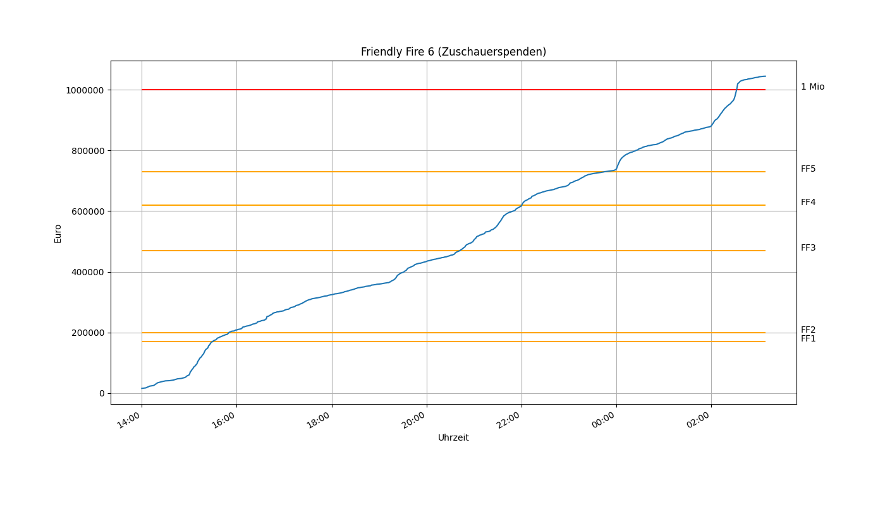
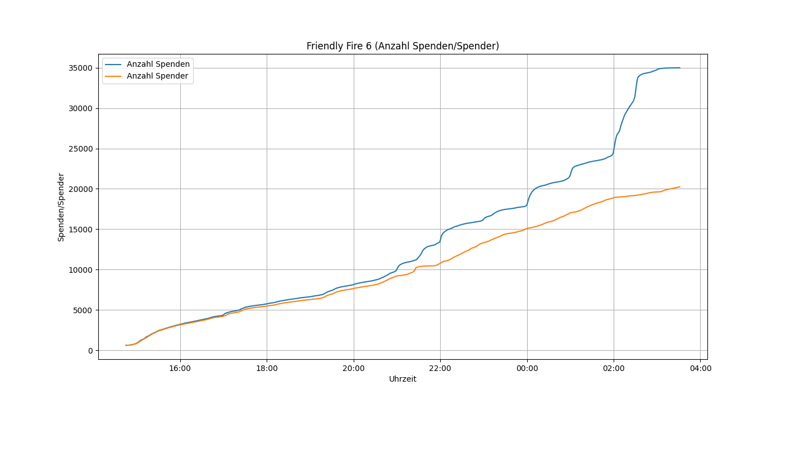

## Statistiken zur Spendenaktion Friendly Fire

Das Rust-Programm hat über den Zeitraum von Friendly Fire 6 jede Minute den aktuellen Spendenstand von der [Betterplace API](https://github.com/betterplace/betterplace_apidocs) abgefragt.
Das Ergebnis ist maschinenlesbar in donations.json zu finden.
Das Python-Skript plot.py zeichnet die untenstehenden Grafiken zum Spendenverlauf:

